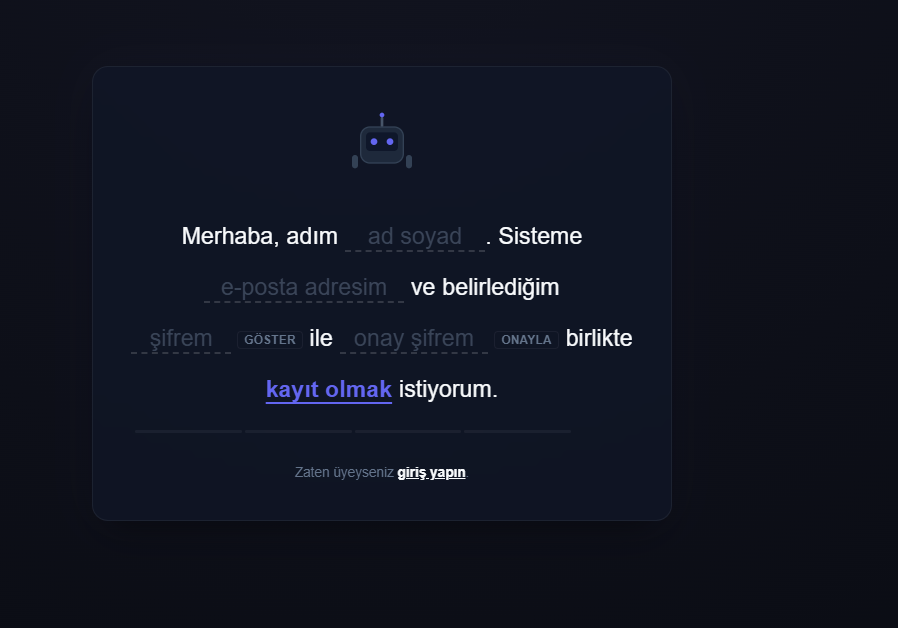
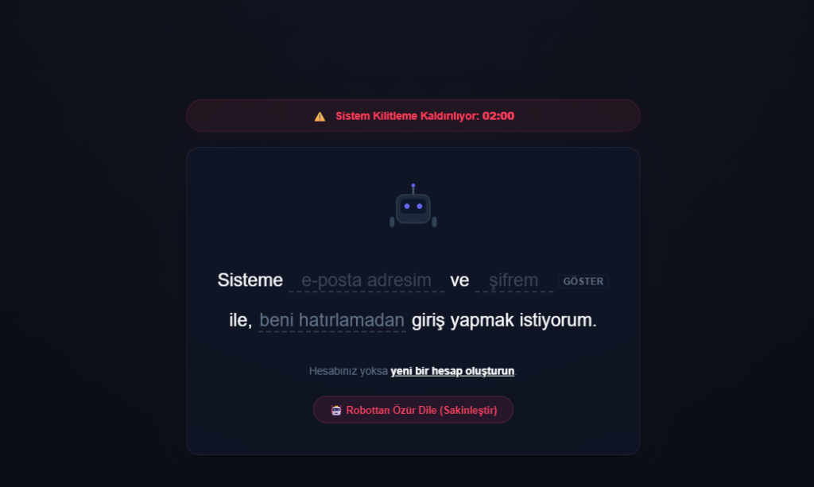

# 🤖 VerboAuth — Interactive Cyber Mascot & Natural Language Auth Portal

Bu proje, alışılmışın dışına çıkan modern **Doğal Dil Arayüzü (Natural Language Form)** tasarımı ile etkileşimli, oyunlaştırılmış ve üst düzey siber güvenlik önlemleriyle korunan bir üyelik/giriş (auth) portalıdır. 

Klasik, sıkıcı form kutuları yerine doğrudan cümle yapısı kuran bir form tasarımı sunar. Ayrıca kullanıcı hareketlerine anlık tepkiler veren sevimli/kızgın bir robot maskot içerir.

## 📸 Ekran Görüntüleri (Screenshots)

<p align="center">
  
  
</p>

---

## ✨ Öne Çıkan Özellikler

### 1. Doğal Dil Arayüzü (Natural Language UI)
* Giriş ve kayıt formları tamamen okunaklı cümlelerden oluşur (`"Sisteme [e-posta] ve [şifrem] ile..."`).
* **Otomatik Genişleyen Girdiler (Auto-Expanding Inputs):** Metin kutularının genişliği, kullanıcı yazı yazdıkça harf genişliğine göre milisaniyelik bir sürede dinamik olarak genişler.
* **Yumuşak Yükseklik Geçişi (Animated Card Height):** Form sekmeleri değiştikçe veya girdiler uzadıkça arka plandaki kapsayıcı kart dikey olarak pürüzsüzce esner.
* **Akıcı Panel Geçişleri:** Giriş ve kayıt ekranları arası geçişler özel tasarlanmış bezier eğrili fade-in ve slide-up animasyonları ile gerçekleşir.

### 2. Etkileşimli Siber Maskot (Interactive Mascot)
* **Şifre Gizleme (Cover Eyes):** Şifre veya onay şifresi alanlarına odaklanıldığında robot kollarını gözlerine götürerek gözlerini kapatır.
* **Gizlice Dikizleme (Peeking):** Şifreyi göster seçildiğinde robot sol gözünü açar ve kolunu biraz indirerek şifreyi dikizler.
* **Beni Hatırla Animasyonu (Remember Me):** "Beni Hatırla" seçildiğinde robot kafasını eğip sağ koluyla bir şeyler yazar (scribble animasyonu), ardından elini kaldırıp Thumbs Up (OK) işareti yaparak ekranında `SAVED 👍` yazısını gösterir.

### 3. Dinamik Hesap Kilitleme & Sakinleştirme Oyunu (Gamified Cooldown)
* **Kızgın Robot Modu:** Üst üste 3 kez hatalı giriş yapıldığında robotun gözleri kırmızıya döner, kızgın kaşları belirir ve kafa ledi kırmızı yanıp söner. Sayfa yenilense dahi robot 2 dakika boyunca sinirli kalır.
* **Üst Menü Zamanlayıcı:** Robot sinirliyken kartın üstünde saniye saniye azalan fütüristik bir geri sayım barı belirir.
* **Robottan Özür Dileme (Cooldown Deduction):**
  * Kilit süresi son 1 dakikaya (01:00) girdiğinde ekranın altında **`🤖 Robottan Özür Dile`** butonu aktifleşir.
  * Kullanıcının toplam **3 adet özür dileme hakkı** vardır. Her tıklandığında kilit süresinden **10 saniye düşürülür**.
  * **Sinyal Dalgalanması (Reaction Game):** Buton rastgele sürelerde (1.5s - 3.5s) aktif ve deaktif olur. Deaktif olduğunda buton üzerinde `📡 Parazit Algılandı...` yazar. Kullanıcı sinyal yeşilken basmak zorundadır.
  * **Robot Düşünme Süresi:** Her başarılı tıklamadan sonra buton 5 saniyeliğine cooldown'a girer (`⏳ Robot Düşünüyor...`).

### 4. Gelişmiş Siber Güvenlik Altyapısı
* **Helmet.js:** Sunucu HTTP başlıklarını güvenli hale getirir.
* **Express Rate Limit:** Sunucu genelinde ve auth API'sinde brute-force saldırılarını engellemek için istek sınırlandırması uygular.
* **XSS Sanitization:** Girdi alanlarından gelecek XSS betiklerini temizler.
* **MongoDB Sanitize:** NoSQL injection saldırılarını engeller.
* **Güçlü Şifreleme:** Şifreler veritabanına `bcryptjs` (salt=12) ile hash'lenerek kaydedilir.
* **JWT (JSON Web Token):** Çift token yapılı (Access & Refresh Token) güvenli oturum yönetimi sunar.

---

## 🛠️ Kurulum ve Çalıştırma

Projeyi kendi sunucunuzda veya yerel bilgisayarınızda çalıştırmak için aşağıdaki adımları takip edebilirsiniz:

### 1. Gereksinimler
* Node.js (v14 veya üzeri)
* MongoDB (Atlas veya Local kurulumu)

### 2. Kurulum
Repoyu bilgisayarınıza indirin ve bağımlılıkları yükleyin:
```bash
git clone https://github.com/kullaniciadi/proje-adi.git
cd proje-adi
npm install
```

### 3. Yapılandırma (.env)
Kök dizinde yer alan `.env.example` dosyasının adını `.env` olarak değiştirin ve kendi bilgilerinizi girin:
```env
# MongoDB bağlantı adresiniz (Atlas URI veya Local MongoDB adresi)
MONGODB_URI=mongodb://localhost:27017/veritabani_adi

# JWT için güvenli şifreleme anahtarları (Minimum 64 karakter)
JWT_SECRET=gizli_jwt_anahtariniz
JWT_REFRESH_SECRET=ikinci_farkli_jwt_anahtariniz
```

### 4. Çalıştırma
Projeyi başlatmak için aşağıdaki komutu çalıştırın:
```bash
npm start
```
Sunucu varsayılan olarak `http://localhost:5000` adresinde çalışacaktır. Tarayıcınızdan bu adrese giderek portali test edebilirsiniz.

---

## 📁 Klasör Yapısı

```text
├── public/                # İstemci (Frontend) dosyaları
│   ├── index.html         # Portal HTML yapısı
│   ├── style.css          # Tüm özelleştirilmiş fütüristik CSS stilleri ve animasyonlar
│   └── app.js             # Form işleme, maskot animasyonları ve API istek mantığı
├── server.js              # Node.js / Express backend ve siber güvenlik katmanı
├── .env                   # Çevresel değişkenler (Veritabanı ve JWT anahtarları)
├── .env.example           # Örnek çevresel değişkenler şablonu
└── package.json           # Proje bağımlılıkları ve scriptler
```

---

## 📄 Lisans
Bu proje [MIT Lisansı](LICENSE) altında lisanslanmıştır. Dilediğiniz gibi fork'layabilir, projelerinizde kullanabilir ve geliştirebilirsiniz!
